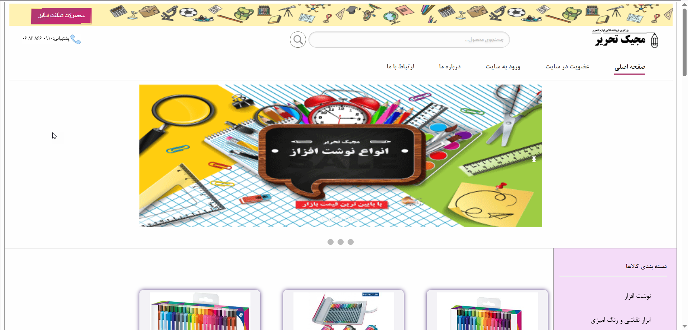
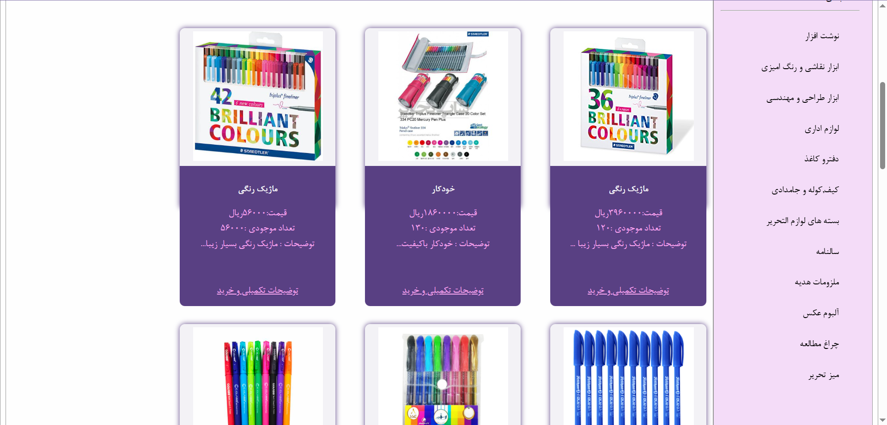
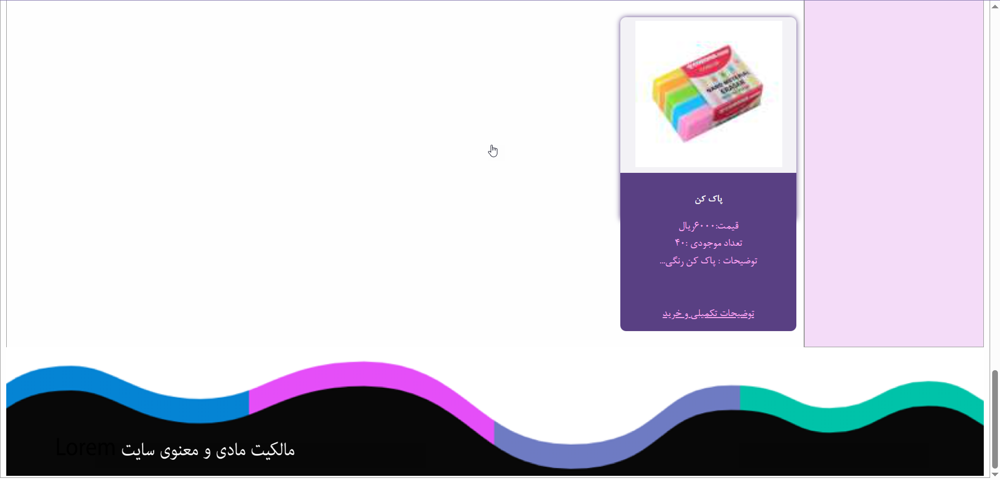
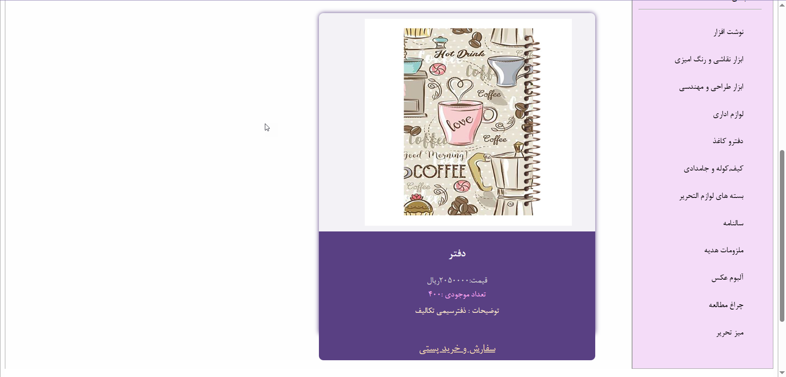
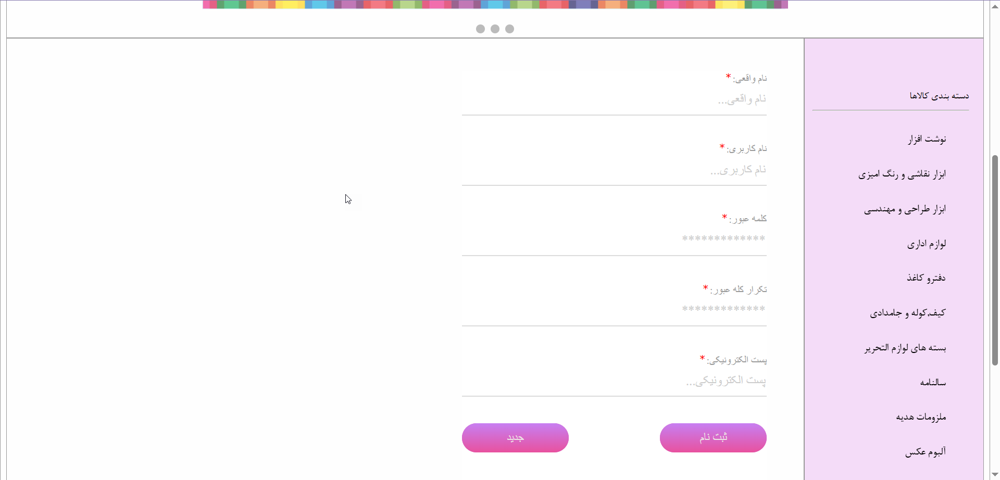
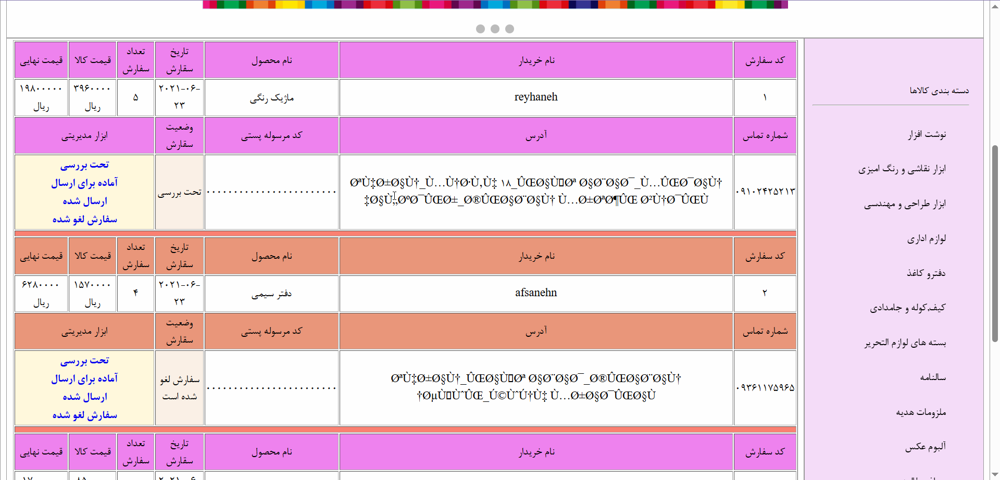

# Magic Tahrir

A simple stationery shop website developed using PHP, HTML, CSS and MySQL.

## Features
- User registration and login
- Product browsing
- Product search
- Product details
- Order management
- Admin panel
- Product management
- Order management

## Technologies
- PHP
- MySQL
- HTML
- CSS

## Database
The project includes `shop_db.sql` for creating the database.

## How to Run
1. Install WAMP/XAMPP
2. Copy the project into the `www` folder
3. Import `shop_db.sql` into phpMyAdmin
4. Configure the database connection
5. Open the project through localhost

6. ## Screenshots

### Home Page

### Products Page

### Product Details

### Login Page

### Register Page

### Order Page

### Admin Panel

